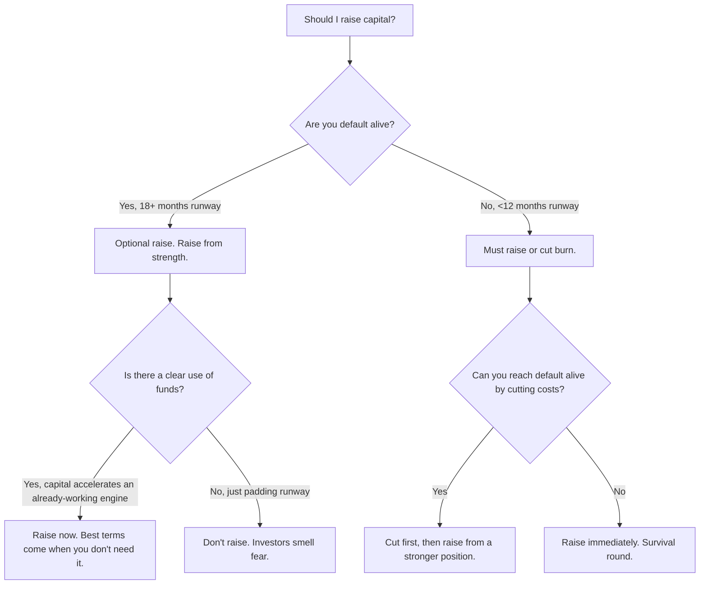

# Fundraising Decision Tree

> **Stage:** Pre-seed through Series B
> **Last updated:** May 2026

A structured framework for deciding whether, when, how much, and from whom to raise capital.

---

## The Core Decision: Should You Raise?



---

## How Much to Raise

| Stage | Typical Raise | Runway Target | Dilution Target |
|-------|---------------|---------------|-----------------|
| Pre-seed | $500K – $2M | 18-24 months | 10-15% |
| Seed | $2M – $5M | 18-24 months | 15-20% |
| Series A | $8M – $20M | 24-36 months | 20-25% |
| Series B | $20M – $60M | 24-36 months | 15-20% |

**Rule of thumb:** Raise enough to hit the milestones that justify your next round at a significantly higher valuation. If you can't articulate those milestones, don't raise.

---

## From Whom: Investor Tier Framework

### Tier 1: Value-Add Angels & Micro-VCs
- **Who:** Operators who've done your job before. Domain experts with operating experience.
- **When:** Pre-seed and seed. You need help, not just money.
- **Red flag:** "I can intro you to people" — this is not value-add, this is a LinkedIn connection.

### Tier 2: Brand-Name Seed Funds
- **Who:** YC, a16z seed, NFX, First Round, etc.
- **When:** Seed. The brand signals quality to downstream investors.
- **Red flag:** Partner is on 15+ boards and won't return your texts.

### Tier 3: Generalist VCs
- **Who:** Multi-stage funds that do seed through growth.
- **When:** Series A+. Validate they actually lead rounds at your stage.
- **Red flag:** "We'll do a small check and see how it goes" — they're testing, not committing.

### Tier 4: Strategic / Corporate VCs
- **Who:** Google Ventures, Salesforce Ventures, etc.
- **When:** Series B+. Rarely before.
- **Red flag:** They want exclusivity, right of first refusal, or board observer rights that constrain your exit options.

---

## When to Raise (Timing)

### Raise NOW if:
- You have clear traction momentum (growth accelerating month-over-month)
- You've identified a capital-efficient growth channel and need fuel to scale it
- You have a term sheet in hand (nothing creates urgency like a real offer)
- The market window is open (your category is hot, interest rates are favorable)

### WAIT if:
- Your metrics are flat or declining
- You haven't figured out your core growth engine
- You're raising to fix a team problem (hire the right people first)
- The market is in a downturn and you can survive it without raising

---

## The Process

```
Week 1-2: Prepare materials (deck, data room, financial model)
Week 3-4: Soft circle (5-10 warm intros to test the pitch)
Week 5-8: Full process (20-30 meetings, parallel-tracked)
Week 9-10: Term sheet negotiation and close
```

**Critical rule:** Never run a linear process (meet one, wait, meet another). Always parallel-track. You want multiple term sheets on the table simultaneously.

---

## Red Flags That Kill Fundraises

1. **"We have no competitors."** Every company has competitors. Saying otherwise signals naivety.
2. **Vanity metrics instead of core metrics.** "1M downloads" means nothing without DAU, retention, and revenue.
3. **Overly complex financial models.** If you can't explain your model in 2 minutes, it's too complex.
4. **"The market is $500B."** Investors want to hear your bottom-up TAM, not a Gartner report citation.
5. **Founder conflict.** If the founding team can't finish each other's sentences, investors notice.
6. **Fundraising while fundraising.** If you're raising a priced round, don't also be running a side process for bridge financing.

---

## Post-Raise: What to Do in the First 30 Days

1. Announce strategically (not Day 1 — wait for a product/customer milestone)
2. Revisit your operating plan against the milestones you promised investors
3. Set up investor update cadence (monthly, same format, no exceptions)
4. Don't increase burn rate immediately — ease into the plan
5. Start building relationships with the next-round investors *now*