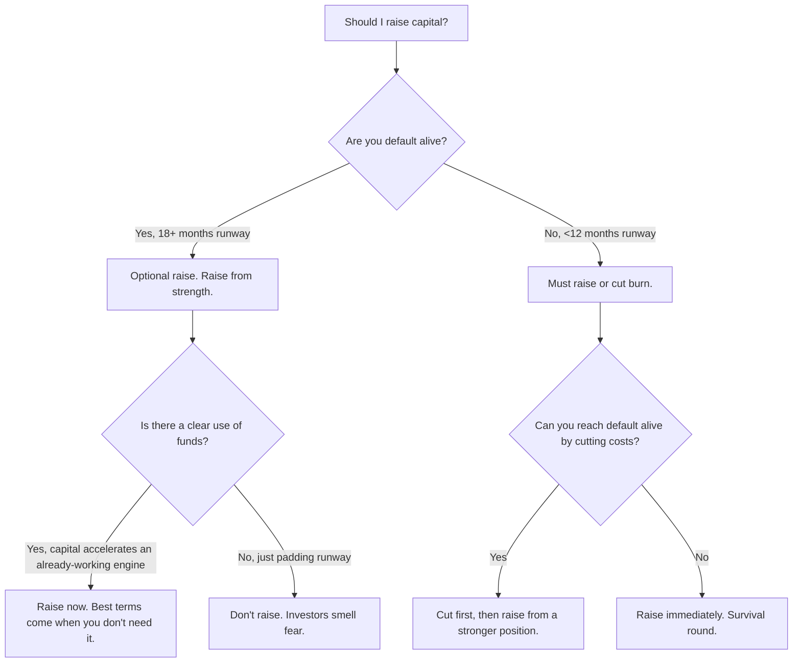

# Fundraising Decision Tree

> **Stage:** Pre-seed through Series B  
> **Last updated:** May 2026

Structured framework for whether, when, how much, and from whom to raise capital.

---

## Pre-Action Checklist

Before fundraising advice:

- [ ] Company stage stated (pre-seed / seed / A / B)
- [ ] Runway months and monthly burn known (or user declines → note assumption)
- [ ] Default alive? (can reach profitability on current cash without raising)
- [ ] Clear use of funds if raising (milestones, not "runway padding")
- [ ] SaaS? If yes and metrics available → run `tools/saas-metrics/saas_health.py` first (see [tool-invocation.md](tool-invocation.md))

---

## The Core Decision: Should You Raise?



---

## How Much to Raise

| Stage | Typical Raise | Runway Target | Dilution Target |
|-------|---------------|---------------|-----------------|
| Pre-seed | $500K – $2M | 18-24 months | 10-15% |
| Seed | $2M – $5M | 18-24 months | 15-20% |
| Series A | $8M – $20M | 24-36 months | 20-25% |
| Series B | $20M – $60M | 24-36 months | 15-20% |

**Rule of thumb:** Raise enough to hit milestones that justify the next round at a significantly higher valuation.

**Dilution modeling:** Run `python tools/equity-calculator/equity_calc.py` — do not estimate cap table in prose alone.

---

## From Whom: Investor Tier Framework

### Tier 1: Value-Add Angels & Micro-VCs
- **When:** Pre-seed and seed.
- **Red flag:** "I can intro you to people" only.

### Tier 2: Brand-Name Seed Funds
- **When:** Seed.
- **Red flag:** Partner on 15+ boards, unresponsive.

### Tier 3: Generalist VCs
- **When:** Series A+.
- **Red flag:** "Small check to see how it goes."

### Tier 4: Strategic / Corporate VCs
- **When:** Series B+ typically.
- **Red flag:** Exclusivity, ROFR, constraining board rights.

---

## When to Raise (Timing)

**Raise NOW if:** traction accelerating; capital-efficient channel to scale; term sheet in hand; favorable market window.

**WAIT if:** flat/declining metrics; no growth engine; raising to fix team; can survive downturn without raise.

---

## The Process

```
Week 1-2: Prepare materials (deck, data room, model)
Week 3-4: Soft circle (5-10 warm intros)
Week 5-8: Full process (20-30 meetings, parallel-tracked)
Week 9-10: Term sheet negotiation and close
```

**Critical rule:** Parallel-track meetings; aim for multiple term sheets.

**Deck readiness:** Use [templates/pitch-deck-outline.md](../templates/pitch-deck-outline.md) + `python tools/pitch-deck-scorer/scorer.py`.

---

## Red Flags That Kill Fundraises

1. "We have no competitors."
2. Vanity metrics without retention/revenue.
3. Overly complex financial models.
4. Top-down "$500B market" only.
5. Founder conflict visible in meetings.
6. Priced round + side bridge process simultaneously.

---

## Post-Raise: First 30 Days

1. Announce strategically (tie to milestone).
2. Revisit operating plan vs promised milestones.
3. Monthly investor updates — same format.
4. Don't spike burn immediately.
5. Start next-round relationship building now.
